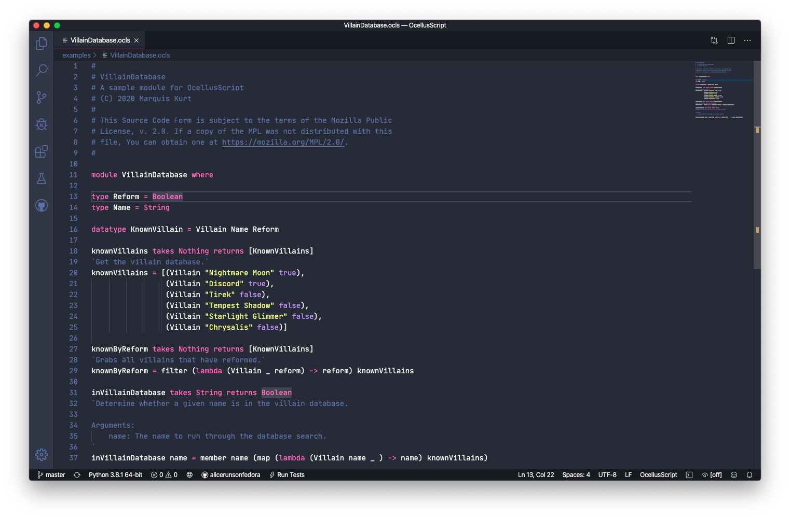

# OcellusScript for VS Code

This language package adds language support for [OcellusScript](https://github.com/alicerunsonfedora/ocellusscript), a Haskell-inspired functional programming language.

## Installation

You can either install this extension in the VS Code marketplace (when finished) or clone this repository into your VS Code extensions folder (`<home>/.vscode/extensions`).

> ⚠️ This extension is still a work in progress as OcellusScript is still being worked on.